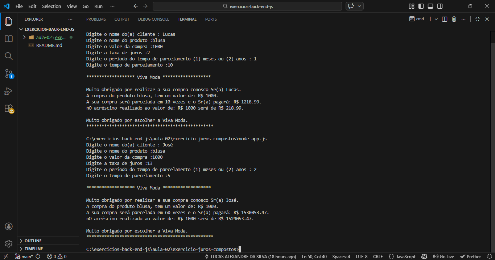

# 💰 Cálculo de Juros Compostos – Venda Parcelada

Aplicação back-end desenvolvida em **Node.js** para realizar o cálculo de **juros compostos** em uma venda parcelada, com entrada de dados via terminal e validações para garantir resultados corretos.

## 📌 Descrição do Projeto

O projeto **Cálculo de Juros Compostos – Venda Parcelada** foi desenvolvido com o objetivo de praticar conceitos fundamentais de **JavaScript no Back-End**, utilizando o ambiente **Node.js** e entrada de dados via terminal.

A aplicação simula uma venda parcelada de uma empresa fictícia (**Viva Moda**), realizando o cálculo do montante final com base no valor da compra, taxa de juros e período de parcelamento.

## 📄 Exercício Proposto

Você pode acessar o PDF com o exercício proposto clicando no link abaixo:

[Baixar Exercício Proposto (PDF)](./docs/Missao-1-%20Back-End.docx.pdf)


## 🎯 Objetivo

- Praticar lógica de programação com JavaScript
- Trabalhar entrada e saída de dados via terminal
- Aplicar o cálculo de juros compostos
- Implementar validações de dados do usuário
- Reforçar conceitos básicos de back-end com Node.js

## 🛠️ Tecnologias Utilizadas

- **JavaScript (Node.js)** – Lógica da aplicação  
- **Readline** – Entrada de dados via terminal  

## ⚙️ Funcionalidades

- Entrada de dados do usuário pelo terminal:
  - Nome do cliente
  - Nome do produto
  - Valor da compra
  - Taxa de juros
  - Tempo de parcelamento

- Opção de parcelamento em:
  - **Meses**
  - **Anos** (com conversão automática para meses)

- Cálculos:
  - Cálculo de juros compostos
  - Cálculo do acréscimo sobre o valor inicial

- Validações para:
  - Campos vazios
  - Dados numéricos inválidos
  - Valores menores ou iguais a zero
  - Período de parcelamento inválido

- Forma de exibição:
  - Exibição de um resumo final da compra no terminal

## 📂 Estrutura do Projeto

📁 exercicio-juros-compostos  
┣ 📁 docs  
┃ ┗ 📄 Missao1-Back-End.pdf  
┣ 📁 img  
┃ ┗ 🖼️ aplicacao-execucao.png  
┣ 🟨 app.js  
┗ 📝 README.md  

## ▶️ Como Executar o Projeto

1.Clone o repositório para sua máquina:
```
git clone https://github.com/LucasAlexandreDev/exercicios-back-end-js.git
```

2.Abra o projeto no Visual Studio Code:
```
code .
```

3.Acesse a pasta do projeto:

```
cd aula-02
cd exercicio-juros-compostos
```
4.Inicie o projeto:

```
node app.js
```

## 📚 Aprendizados

Durante o desenvolvimento deste projeto, foram praticados:

- Uso do `"use strict"` para código mais seguro  
- Entrada de dados via terminal com `readline`  
- Conversão de dados de `string` para `number`  
- Estruturas condicionais para validação  
- Cálculo matemático de juros compostos  
- Conversão de tempo de parcelamento (anos para meses)  
- Organização e clareza na saída de dados  

## 🎓 Informações Acadêmicas

- **Desenvolvedor:** Lucas Alexandre da Silva  
- **Curso:** Técnico em Desenvolvimento de Sistemas  
- **Instituição:** SENAI Jandira  
- **Projeto:** Cálculo de Juros Compostos – Venda Parcelada
- **Empresa (simulação):** Viva Moda  
- **Data:** 04/02/2026  
- **Disciplina:** Back-End
- **Orientador:** Marcel  
